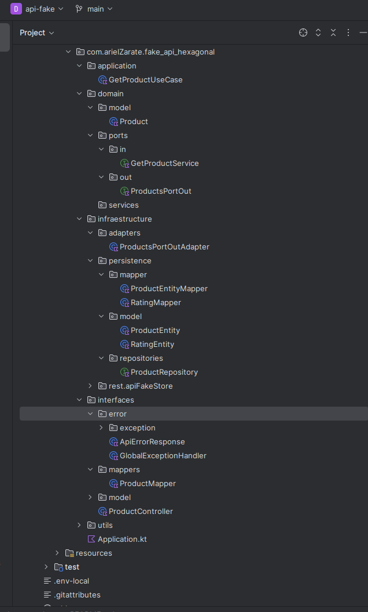

# api fake store api arquitectura hexagonal





## Public Api

- URL FOR PUBLISHED DOCUMENTACTION

### https://documenter.getpostman.com/view/12679400/2sAYHxo4kp

###     Colection name
Fake store api

#### /api/products


#### /api/productos/2


#### /api/products


## Docker

Esta app se puede levantar con Docker Compose.
Incluye PostgreSQL para persistencia de datos.

```bash
docker-compose up --build -d 
```
##### 1 START CONTAINER
```bash
docker-compose up --build
```
##### 2 STOP CONTAINER 
```bash
docker-compose down
```

##### 3 RESTART CONTAINER
```bash
docker-compose down -v
```

## Volumen persistente 
```yaml
volumes:
  - db_data:/var/lib/postgresql/data

```
- Guarda los datos fuera del contenedor para que persistan aunque lo borres.
- db_data es el nombre del volumen definido abajo:

```yaml
volumes:
  db_data:

```
